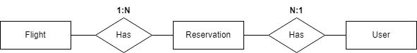

# Base de datos: Entidad-relacion y tablas

1. __Tabla "User"__: información de los usuarios que solicitan reservas

    | Campo        | Tipo        | Descripción                          |
    |--------------|-------------|--------------------------------------|
    | id           | INT         | Identificador único                  |
    | user_name    | VARCHAR     | Nombre del usuario                   |
    | user_id      | VARCHAR     | Identificación personal del usuario  |
    | email        | VARCHAR     | Correo electrónico del administrador |
    | ...          | ...         | ...                                  |

2. __Tabla "Flight"__: Información de vuelos registrados en el sistema.

    | Campo          | Tipo        | Descripción                                       |
    |--------------  |-------------|-------------------------------------------------- |
    | id             | INT         | Identificador único                               |
    | origin         | VARCHAR     | Nombre de la ciudad de origen                     |
    | destination    | VARCHAR     | Nombre de la ciudad de destino                    |
    | departure date | DATETIME    | Fecha de partida del vuelo                        |
    | arrival date   | DATETIME    | Fecha de llegada del vuelo                        |
    | airline        | VARCHAR     | Nombre de la aerolinea a la que pertenece el vuelo|
    | available_seats| INTEGER     | Sillas disponibles en el vuelo                    |
    | price          | DECIMAL     | Precio de viajar en este vuelo                    |
    | ...            | ...         | ...                                               |

3. __Tabla "Reservation"__:  detalles de una reserva hecha por un usuario

    | Campo           | Tipo    | Descripción                                |
    |--------------   |---------|------------------------------------------- |
    | id              | INT     | Identificador único del turno              |
    | user(FK)        | INT     | Identificador del usuario de la tabla User |
    | flight(FK)      | INT     | Identificador del vuelo de la tabla Flight |
    | ...             | ...     | ...                                        |
